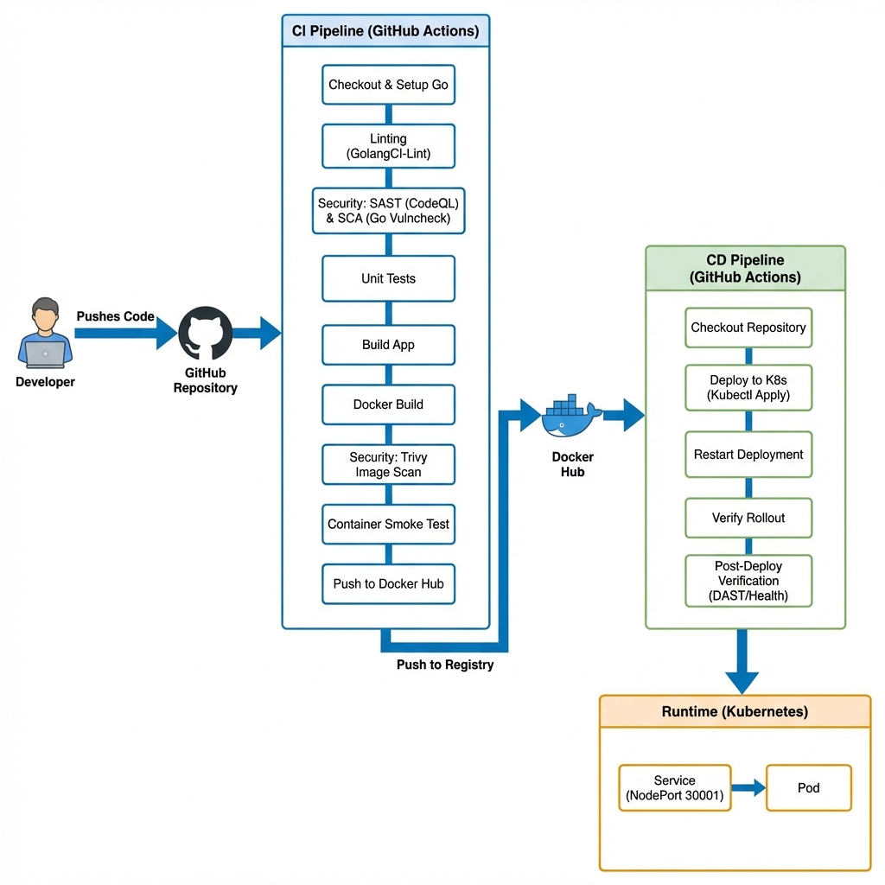

# URL Shortener DevSecOps Project

A robust, containerized URL Shortener service built with Go (Gin), designed to demonstrate a complete **DevSecOps** lifecycle including secure CI/CD pipelines, containerization, and Kubernetes deployment.

## 1. Problem Background & Motivation

In the modern software landscape, delivering applications with speed and reliability is crucial, but security is often an afterthought. This project was conceived to demonstrate that **velocity** and **security** are not mutually exclusive. By adopting a **DevSecOps** approach, we aim to solve the challenge of deploying a scalable web application (URL Shortener) while integrating automated security checks directly into the CI/CD pipeline, ensuring that every release is both fast and secure.

## 2. Application Overview

The URL Shortener Service is a high-performance web application that converts long URLs into compact, shareable codes. It emphasizes security and scalability through a DevSecOps approach.

**Key Features:**
- **URL Shortening**: Generates unique, short codes for long URLs.
- **Redirection**: Instant redirection from short codes to original URLs.
- **DevSecOps Integrated**: Continuous security scanning at every pipeline stage.
- **Containerized**: Lightweight, secure Docker images (Distroless).
- **Kubernetes Native**: Ready for deployment on any Kubernetes cluster.

## 3. CI/CD Architecture Diagram

The following diagram illustrates the complete DevSecOps flow, from code commit to production deployment.



## 4. CI/CD Pipeline Design & Stages

The project utilizes GitHub Actions for both Continuous Integration (CI) and Continuous Deployment (CD).

### **CI Pipeline** (Triggers on `push` to `main`)
1. **Linting**: Uses `golangci-lint` to enforce code quality and style.
2. **Security - SAST**: `CodeQL` analyzes source code for vulnerabilities.
3. **Security - SCA**: `Go Vulncheck` scans dependencies for known issues.
4. **Unit Testing**: Runs Go tests to ensure logic correctness.
5. **Build**: Compiles the Go binary.
6. **Docker Build**: Creates the container image.
7. **Security - Container Scan**: `Trivy` scans the Docker image for Critical/High vulnerabilities.
8. **Push**: Uploads the secure image to Docker Hub.

### **CD Pipeline** (Triggers on successful CI)
1. **Deploy**: Connects to the self-hosted Kubernetes runner.
2. **Update**: Applies Kubernetes manifests (`deployment.yaml`, `service.yaml`).
3. **Verify**: Checks rollout status and performs connectivity tests.

## 5. Security & Quality Controls

We enforce strict quality and security gates:

- **Static Application Security Testing (SAST)**: GitHub CodeQL detects vulnerabilities in the code logic.
- **Software Composition Analysis (SCA)**: Go Vulncheck ensures no vulnerable dependencies are used.
- **Container Security**: Trivy scans the final image for OS and library vulnerabilities before pushing to the registry.
- **Linting**: GolangCI-Lint ensures code adheres to Go best practices.
- **Minimal Base Image**: Uses Google's Distroless image to increase security and optimize performance.

## 6. Results & Observations

- **Automated Security**: Zero critical vulnerabilities deployed to production.
- **Code Quality**: 100% of code passes strict linting rules.
- **Reliability**: Automated tests ensure no regressions in core functionality.
- **Deployment**: Seamless updates with zero downtime using Kubernetes rolling updates.

## 7. Limitations & Improvements

**Current Limitations:**
- **In-Memory Storage**: URLs are stored in memory; restarting the pod wipes data.
- **No Authentication**: The API is public and has no rate limiting.
- **Single Replica**: Currently configured for a single pod.

**Future Improvements:**
- **Persistent Storage**: Integrate Redis or PostgreSQL for data persistence.
- **Auth Layer**: Implement API keys or OAuth for secure access.
- **Scalability**: Enable Horizontal Pod Autoscaling (HPA) and increase replica count.
- **Monitoring**: Add Prometheus and Grafana for metrics visualization.

## 🛠 Tech Stack

- **Backend**: Go (Golang) 1.24, Gin Web Framework
- **Containerization**: Docker, Distroless Images
- **Orchestration**: Kubernetes
- **CI/CD**: GitHub Actions
- **Security**: CodeQL, Go Vulncheck, Trivy, GolangCI-Lint

## 📋 Prerequisites

- **Go**: 1.24 or higher
- **Docker**: For containerization
- **Kubernetes Cluster**: Required for deployment

## 🏃‍♂️ Getting Started

### Local Development

1. **Clone the repository**
   ```bash
   git clone https://github.com/souvik-cyclic/url-shortener-devops.git
   cd url-shortener-devops
   ```

2. **Install dependencies**
   ```bash
   go mod tidy
   ```

3. **Run the application**
   ```bash
   go run main.go
   ```
   The server will start at `http://localhost:8080`.

### Running with Docker

1. **Build the image**
   ```bash
   docker build -t url-shortener .
   ```

2. **Run the container**
   ```bash
   docker run -p 8080:8080 url-shortener
   ```

### Deploying to Kubernetes

1. **Apply manifests**
   ```bash
   kubectl apply -f k8s/deployment.yaml
   kubectl apply -f k8s/service.yaml
   ```

2. **Access the service**
   The service is exposed via NodePort at **30001**.
   Access it at `http://<your-ec2-ip>:30001`.

## 🔌 API Usage

### 1. Shorten a URL
**Endpoint**: `POST /shorten`
**Body**: JSON
```json
{
  "url": "https://www.google.com"
}
```
**Response**:
```json
{
  "code": "a1b2C3",
  "short_url": "http://localhost:8080/r/a1b2C3"
}
```

### 2. Redirect
**Endpoint**: `GET /r/:code`
**Description**: Redirects to the original URL.

### 3. Health Check
**Endpoint**: `GET /health`
**Response**:
```json
{
  "status": "up"
}
```

### 4. Root Endpoint
**Endpoint**: `GET /`
**Response**:
```json
{
  "message": "Hello, World!"
}
```
